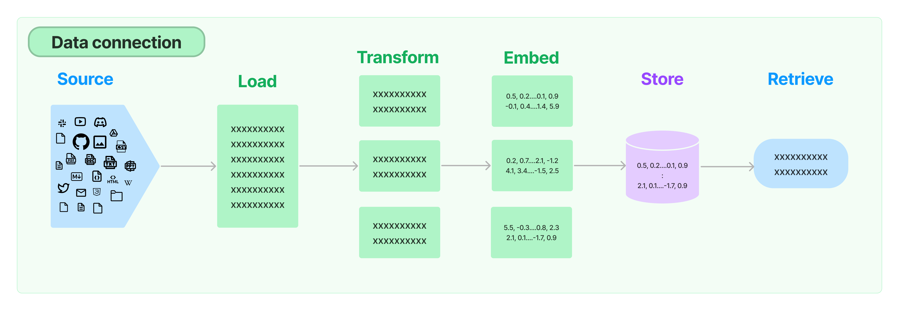

# Description
`RAG-Engine-Template` is a foundational project template designed to harness the capabilities of Retrieval-Augmented Generation (RAG) using LangChain. The primary goal of this repository is to provide a quick-start platform for projects that require RAG capabilities.

> `RAG` is a cutting-edge AI framework that retrieves facts from an external knowledge base, grounding large language models (LLMs) on the most accurate and up-to-date information. This not only enhances the accuracy of LLMs but also provides users with insights into the generative process of the model.
> 

# Project Structure Overview
The following directory layout represents the current design of the RAG-Engine-Template project. It's `important` to note that this structure is `still under active development` and might evolve as the project progresses.

```bash
.
├── Dockerfile             # Docker configuration for deploying the RAG service
├── LICENSE
├── README.md
├── experiments
│   ├── langchain.ipynb    # Notebook for LangChain experiments
│   └── openai-chat.ipynb  # Notebook for OpenAI chat experiments
├── requirements.txt       # List of Python dependencies
└── src
    ├── api
    │   ├── endpoints
    │   │   ├── __init__.py
    │   │   ├── healthz.py  # Endpoint for health checks
    │   │   └── test.py     # Endpoint for testing
    │   ├── schemas
    │   │   ├── __init__.py
    │   │   ├── request_schema.py  # IO schema for API requests
    │   │   └── response_schema.py # IO schema for API responses
    │   └── server.py       # Main API server setup and routes
    ├── db
    │   ├── __init__.py
    │   ├── models.py       # Database table models
    │   ├── session.py      # Database session and connection handling
    │   └── queries.py      # Common database queries or operations
    ├── llm
    │   ├── __init__.py
    │   ├── langchain.py    # LLM LangChain related operations
    │   └── ...             # Other LLM related modules
    └── main.py             # Main entry point for the application, API server startup

```